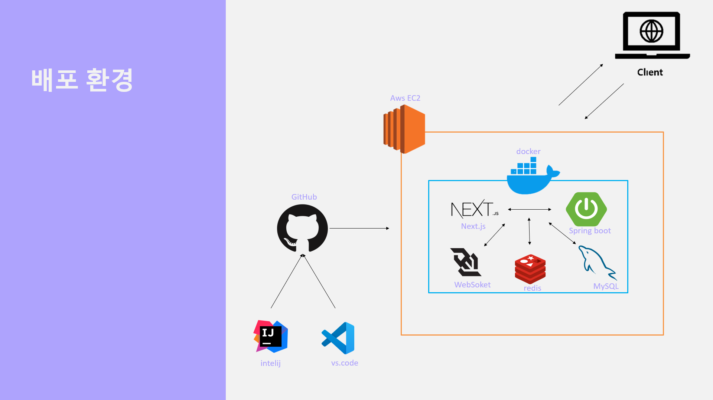

# 🪑 StudyCafe 좌석 예약 시스템

## 📌 프로젝트 소개

**StudyCafe**는 사용자가 웹을 통해 실시간으로 좌석을 예약하고,  
QR코드를 통해 현장에서 인증할 수 있는 **스터디카페 좌석 예약 시스템**입니다.

- 자연어 기반 자동 좌석 예약  
- Redis Pub/Sub 기반의 실시간 좌석 렌더링  
- Spring Scheduler를 이용한 좌석 자동 만료 처리  
- JWT 기반 QR 문자 인증 시스템  

---

## 📁 폴더 구조

```plaintext
backend/
├── config/             # 보안, Redis, 스케줄러 설정
├── controller/         # REST API 처리
├── service/            # 비즈니스 로직
├── repository/         # 데이터 접근 계층
├── entity/             # 도메인 모델 (JPA Entity)
├── dto/                # 요청/응답 DTO
└── StudyCafeApplication.java  # 메인 클래스

## 🗂️ 시스템 아키텍처

본 프로젝트는 AWS EC2 위에 Docker 컨테이너를 통해 프론트엔드와 백엔드를 구성하였으며,  
Redis를 통한 실시간 좌석 전파 및 MySQL 기반의 데이터 관리를 수행합니다.



# 1. 저장소 클론
git clone https://github.com/jaeyoon222/StudyCafe.git
cd StudyCafe

# 2. 도커 실행
docker-compose up --build

## 배포링크
http://43.201.178.143:3000/
